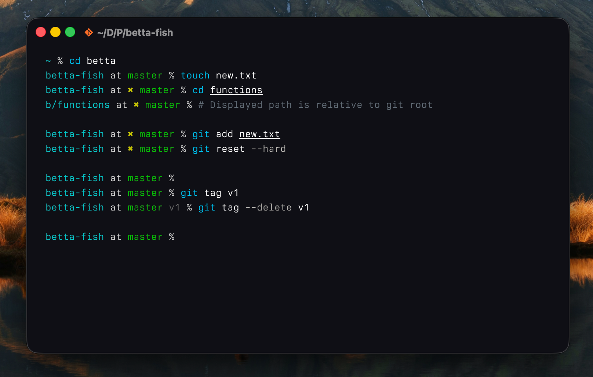
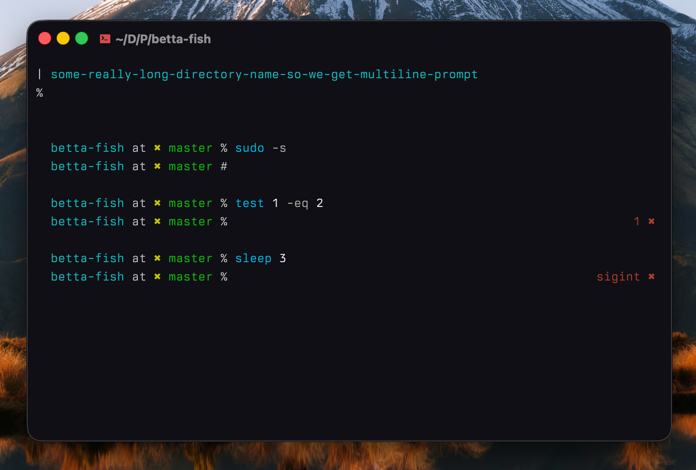

# Betta Fish

My own fish prompt with git integration. Meant to be as simple and fast as possible.

## Git Integration

- Shows dirty status
- Shows the current branch or commit hash
- Shows all tags for current commit, for further context
- The displayed directory is relative to the git root when in a git repository



## Quality of Life Features

- Dynamic multi-line when the line begins getting too long
- Symbol changes based on root status
- Smart error status display on right



## Installation

Clone this repository and run the install script:

```fish
git clone https://github.com/josssch/betta-fish
cd betta-fish
./install.fish
```

By default, this will install to your `~/.config/fish/functions`.
